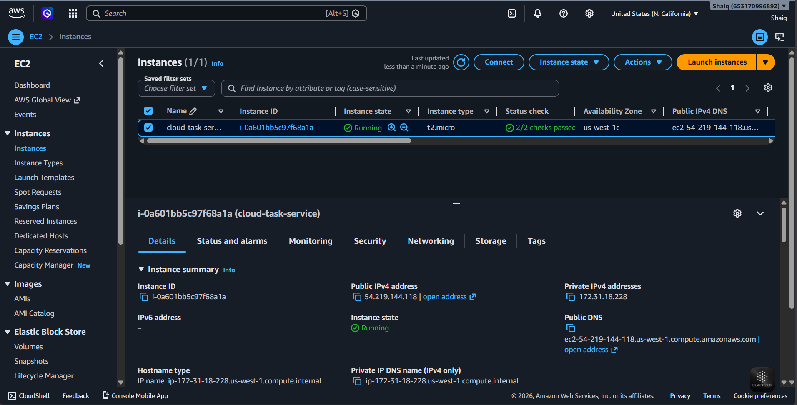
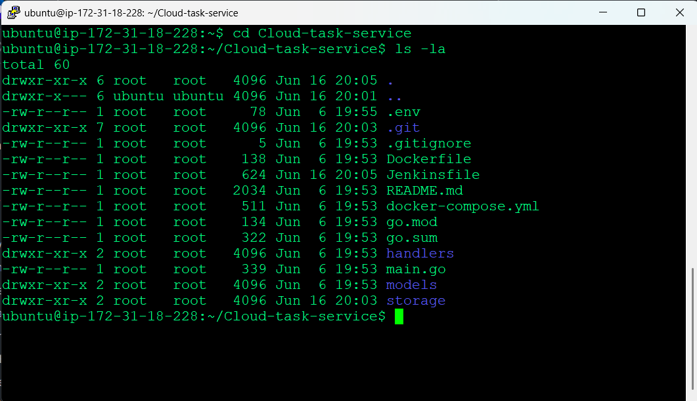
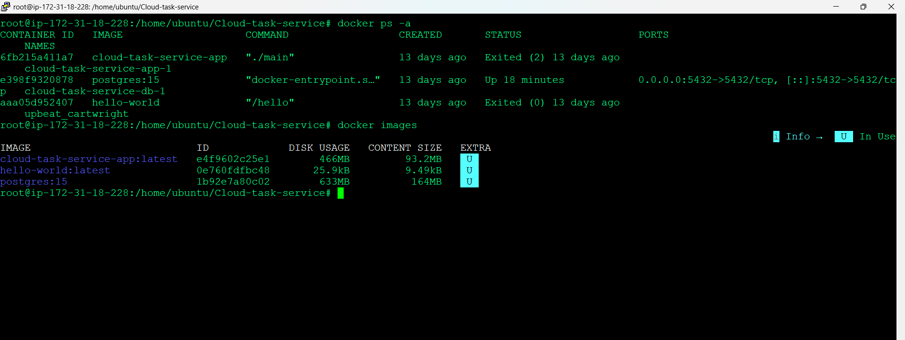
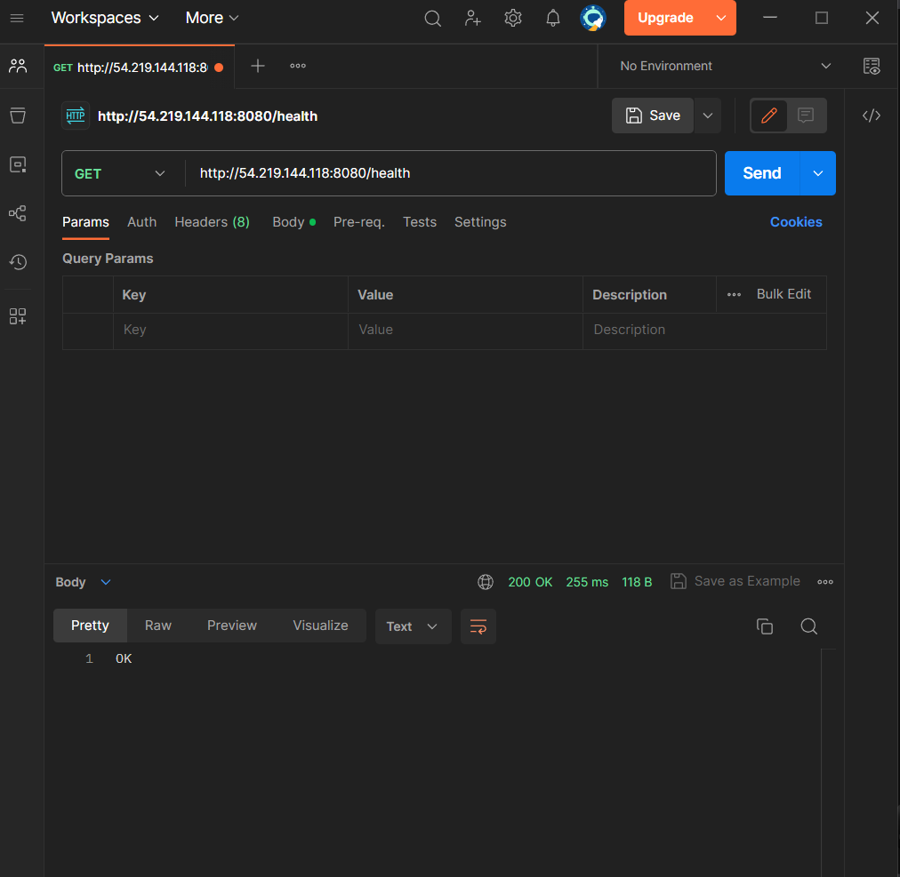
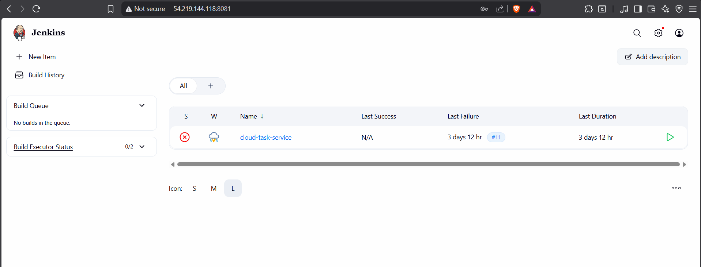
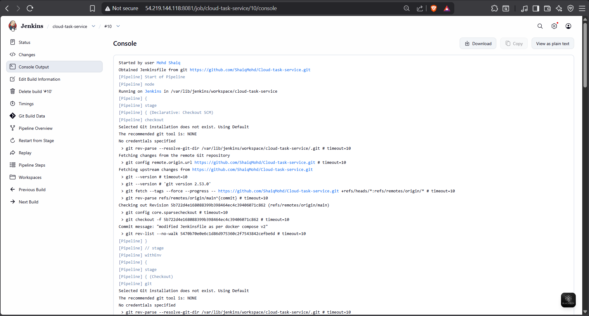

# Cloud Task Service

A cloud-based RESTful Task Management API built with Go, PostgreSQL, Docker, AWS EC2, and Jenkins.

This project demonstrates backend development fundamentals including REST APIs, CRUD operations, database integration, environment-based configuration, containerization, cloud deployment, and CI/CD automation.

---

## Features

* Create tasks
* Retrieve all tasks
* Retrieve a task by ID
* Update tasks
* Delete tasks
* PostgreSQL persistence
* Dockerized application
* Docker Compose multi-container setup
* Environment variable configuration
* Health check endpoint
* AWS EC2 deployment
* Jenkins CI/CD pipeline integration

---

## Tech Stack

* Go (Golang)
* PostgreSQL
* Docker
* Docker Compose
* AWS EC2
* Jenkins
* REST API
* JSON

---

## Project Structure

```text
cloud-task-service
│
├── handlers
├── models
├── storage
│   └── db.go
├── screenshots
├── Dockerfile
├── docker-compose.yml
├── Jenkinsfile
├── .gitignore
├── main.go
└── README.md
```

---

## API Endpoints

### Health Check

```http
GET /health
```

Response:

```text
OK
```

### Create Task

```http
POST /tasks
```

Request:

```json
{
  "title": "Study Go",
  "done": false
}
```

### Get All Tasks

```http
GET /tasks
```

### Get Task By ID

```http
GET /tasks?id=1
```

### Update Task

```http
PUT /tasks?id=1
```

Request:

```json
{
  "title": "Study Docker",
  "done": true
}
```

### Delete Task

```http
DELETE /tasks?id=1
```

---

## Running the Project

### Using Docker Compose

```bash
docker compose up --build
```

Application:

```text
http://localhost:8080
```

---

## Environment Variables

Create a `.env` file:

```env
DB_USER=postgres
DB_PASSWORD=password
DB_NAME=tasksdb
DB_HOST=db
DB_PORT=5432
```

---

## Architecture

```text
Client
   │
   ▼
Go REST API
   │
   ▼
Storage Layer
   │
   ▼
PostgreSQL
```

---

## Deployment Architecture

```text
GitHub
   │
   ▼
 Jenkins
   │
   ▼
Docker Compose
   │
   ├── Go API Container
   └── PostgreSQL Container
           │
           ▼
        AWS EC2
```

---

## Deployment & CI/CD

* Containerized the application using Docker and Docker Compose
* Deployed the application on AWS EC2
* Configured Jenkins for Continuous Integration and Continuous Deployment (CI/CD)
* Automated source code retrieval from GitHub
* Built Docker images through Jenkins pipeline stages
* Managed database and application services using Docker Compose
* Used environment-based configuration through `.env` files

---

## Screenshots

### AWS EC2 Instance Dashboard



### EC2 Server Access (SSH)



### Docker Containers and Images



### Application Health Check



### Jenkins Dashboard



### Jenkins Pipeline Execution



### Jenkins Pipeline Build Logs

.png)

---

## Learning Objectives

This project was built to strengthen skills in:

* Backend Development
* Database Integration
* Docker & Containerization
* Cloud Engineering
* CI/CD Pipelines
* DevOps Fundamentals

---

## Future Improvements

* Terraform Infrastructure as Code
* Kubernetes Deployment
* Authentication & Authorization
* API Documentation (Swagger)
* Automated Testing
* Monitoring & Logging

---

## Deployment Workflow

1. Developer pushes code to GitHub
2. Jenkins pulls the latest source code
3. Docker builds the application image
4. Docker Compose deploys services
5. PostgreSQL and Go API start on AWS EC2
6. Application becomes accessible through public endpoints

---

## Author

**Mohd Shaiq**
